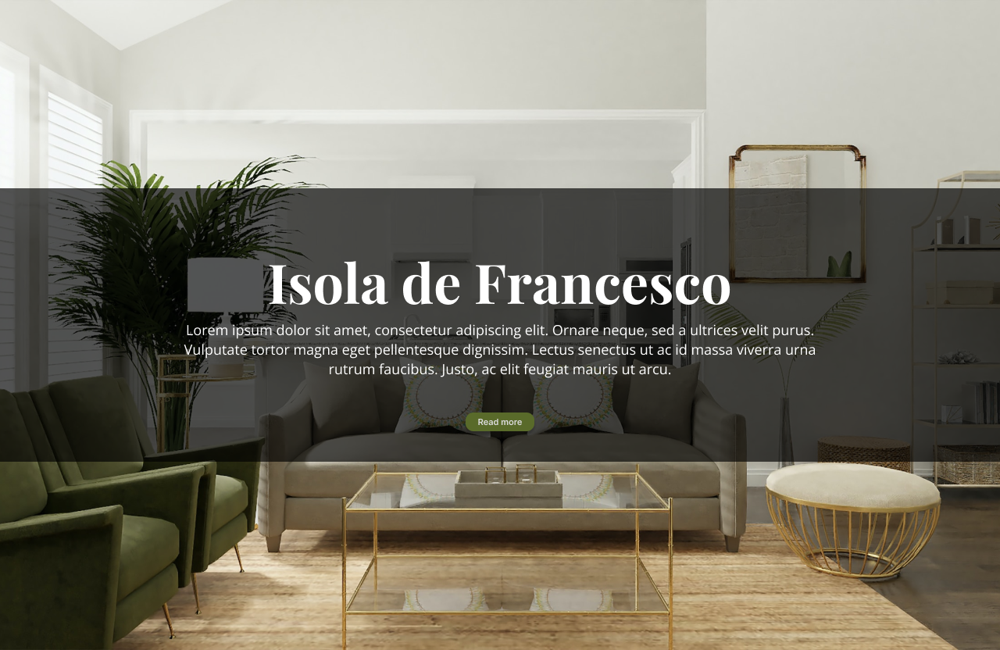

# cpnt262-a4
Assignment 4 - Page Building in Vue/Nuxt
author: Myka Peligrino

## Info
This is an Interior Design Website. I took inspiration from the mockup that I did before.
- Figma link: https://www.figma.com/file/HD4XiWrFqh6JWFbPpI91Fm/dsgn270-achievements1-myka-peligrino?node-id=6%3A34&t=Fy3tM7JU8EuxxZaL-0

## Attributions
- CPNT262 Nuxt Demo ()
- Nuxt tutorial

- Photos from Pexels
  - https://www.pexels.com/photo/wooden-shelves-with-assorted-pots-on-a-white-wall-with-wall-decors-6739226/
  - https://www.pexels.com/photo/person-touching-an-ornament-in-a-ceramic-figurine-6739699/

